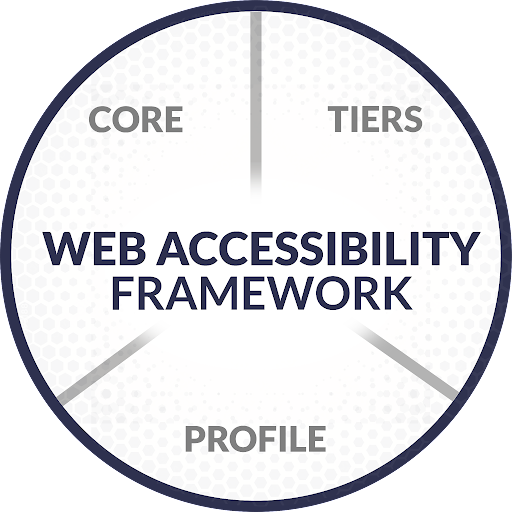
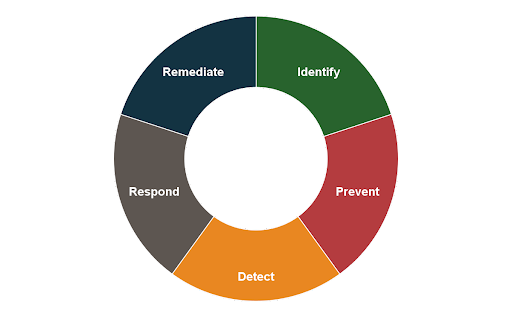

# The Web Accessibility Framework

> A way for all organizations to understand, organize,
improve, and communicate web accessibility.

The Web Accessibility Framework is designed to adapt and adjust to the needs of your organization. Use parts that make sense for your current state and adjust as you continue on your web accessibility journey.

## Meet the Web Accessibility Framework

The framework has three parts:

1. [**Core**](parts/core.md): Core is a list of accessibility outcomes. Your organization customizes this list for its size and need. You’ll find accessibility opportunities and understand what actions to take toward improving accessibility.
2. [**Tiers**](parts/tiers.md): Implementation tiers help you understand your organization’s current and desired state for responding to and managing web accessibility.
3. [**Profiles**](parts/profiles.md): Profiles take an organization’s requirements, objectives, risk appetite, and resources and compare them with the desired outcomes of the Core. Profiles help identify opportunities for improving web accessibility by comparing a current profile with a target profile.

Organizations can use any combination of these framework pieces to help improve accessibility.

## Start using the Web Accessibility Framework

### Example 1: Using only the Core

The simplest way to begin using the Web Accessibility Framework is to start with the Core and choose outcomes that make sense for your organization.

For example, an organization could pick one outcome from each of the Core functions:

1. **Identify**: Critical or higher-priority user paths are identified.
2. **Prevent**: All users are informed and trained according to their role.
3. **Detect**: Automated testing is scheduled on a regular cadence.
4. **Respond**: Detected issues (or groups of issues) are documented and logged in central system along with non-accessibility issues.
5. **Remediate**: Issues are remediated regularly.

With the outcomes selected, the organization can then go through the entire process for even just one piece of critical content.

The idea is it’s better to start small and get through each selected piece of Core once. This starts improving accessibility quickly while helping you learn how you’ll build accessibility into your organization’s structure.
