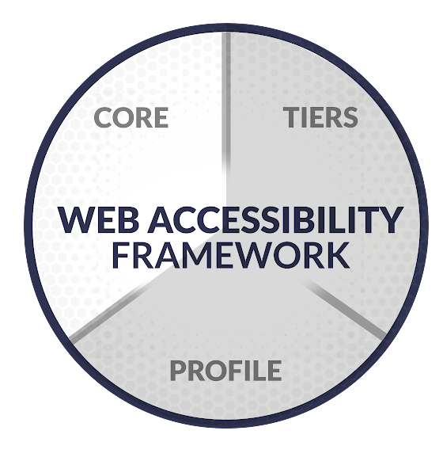

# The Web Accessibility Framework: Core

[Home](../) | [Tiers](tiers.md) | [Profiles](profile.md)

## What is the Core?

The Core is one of three pieces of The Web Accessibility framework.

It’s the foundation of the framework and is made up of five functions:

1. **Identify**: Define your scope, risk tolerance, and goals.
2. **Prevent**: Ways to prevent issues through training, procurement processes with 3rd party software, and change management processes.
3. **Detect**: Ways to detect issues with intentional sampling, manual testing, automated testing, and user feedback.
4. **Respond**: The organization’s response plan to issues including where they’re documented, how they’re prioritized, customer communication guidelines, and legal response plans.
5. **Remediate**: How your organization will fix issues and processes.

Each of these functions has categories with lists of accessibility outcomes organizations can work toward.

For example, Asset Management is a category in the Identify function. Here are some of the outcomes in this category:

* Public-facing websites and pages are inventoried
* Websites, pages, and flows behind logins are inventoried
* Content creation flows and systems are mapped
* Documents are inventoried
* Videos are inventoried

Organizations can use the Core on its own to start improving accessibility right away or it can be used with Profiles and Tiers to build an even more comprehensive accessibility strategy.

> [Example 1: Using only the Core](../examples/01_using_only_the_core.md) shows how the Core could be used.

## Who should use the Core?

Any piece of The Web Accessibility Framework can be used on its own and adjusted to fit an organization’s needs.

That said, the Core is great for all organizations to use. It is a great place for any organization to start especially if they aren’t sure where to begin, want to get started quickly, or are smaller with limited resources.

The Core’s outcomes are also used to build the Profile’s current and desired state. It also helps organizations understand all that goes into an accessibility strategy, so they better understand their current and desired Tier.

## Core outcomes list

View [Core outcomes spreadsheet (Google Sheet)](https://docs.google.com/spreadsheets/d/1LwesBWTze5mnGDl6bRyGPnvXqY5tXQGScKGa1V30rf4/edit?usp=sharing).

[Identify](#identify) | [Prevent](#prevent) | [Detect](#detect) | [Respond](#respond) | [Remediate](#remediate)

### Identify

#### Asset Management (ID.AM)

| Subcategory or Outcome | Subcategory ID |
| :--- | :--- |
| Public facing websites and pages are inventoried | ID.AM-1 |
| Websites, Pages and flows behind logins are inventoried | ID.AM-2 |
| Employee facing websites and pages are inventoried | ID.AM-3 |
| Content creation flows and systems are mapped | ID.AM-4 |
| Types of digital assets used are identified | ID.AM-5 |
| Documents are inventoried | ID.AM-6 |
| Videos are inventoried | ID.AM-7 |
| Websites and user flows are prioritized based user impact and business goals | ID.AM-8 |
| Accessibility roles and responsibilities for the entire workforce and 3rd party stakeholders are established | ID.AM-9 |
| Critical or higher priority user paths are identified | ID.AM-10 |

#### Business environment (ID.BE)

| Subcategory or Outcome | Subcategory ID |
| :--- | :--- |
| The organization’s role in the supply chain and industry is identified and communicated | ID.BE-1 |
| Priorities for organizational mission, objectives, and activities are established and communicated | ID.BE-2 |

#### Governance and Risk Management (ID.GR)

| Subcategory or Outcome | Subcategory ID |
| :--- | :--- |
| Organizational accessibility policy is established and communicated | ID.GR-1 |
| Organizational accessibility policy includes 3rd party software | ID.GR-2 |
| Accessibility roles and responsibilities are coordinated and aligned with internal roles and external partners | ID.GR-3 |
| Legal and regulatory requirements regarding web accessibility are understood and managed | ID.GR-4 |
| Governance and risk management processes address web accessibility risks | ID.GR-5 |
| Risk tolerance is defined | ID.GR-6 |

[Back to top](#core-outcomes-list)

### Prevent

#### Awareness and Training (PR.AT)

| Subcategory or Outcome | Subcategory ID |
| :--- | :--- |
| All users are informed and trained according to their role | PR.AT-1 |
| 3rd party stakeholders understand their roles and responsibilities | PR.AT-2 |
| Senior executives understand their roles and responsibilities | PR.AT-3 |
| Web Accessibility personnel understand their roles and responsibilities | PR.AT-4 |

#### Change management processes (PR.CM)

| Subcategory or Outcome | Subcategory ID |
| :--- | :--- |
| Change management processes including web accessibility are created and communicated | PR.CM-1 |
| Manual testing is incorporated into change management process where appropriate | PR.CM-2 |
| Automated testing is incorporated into change management process where appropriate | PR.CM-3 |

#### Procurement (PR.PR)

| Subcategory or Outcome | Subcategory ID |
| :--- | :--- |
| Web Accessibility is evaluated during the procurement process of new software before purchase | PR.PR-1 |
| Potential Vendors are required to provide a VPAT | PR.PR-2 |
| Accessibility requirements are included in contracts | PR.PR-3 |

[Back to top](#core-outcomes-list)

### Detect

#### Sampling (DE.SA)
| Subcategory or Outcome | Subcategory ID |
| :--- | :--- |
| Sampling methods are used to create cost effective and accurate detection | DE.SA-1 |

#### Manual Testing (DE.MT)

| Subcategory or Outcome | Subcategory ID |
| :--- | :--- |
| Manual testing of a representative sample occurs on a regular cadence for digital assets that have been updated | DE.MT-1 |
| Manual testing includes keyboard testing, screen reader testing, zoom testing and other assistive technology | DE.MT-2 |
| Manual testing tests user flows | DE.MT-3 |
| User testing includes users with disabilities | DE.MT-4 |

#### Automated Testing (DE.AT)

| Subcategory or Outcome | Subcategory ID |
| :--- | :--- |
| Automated testing is scheduled on a regular cadence | DE.AT-1 |
| Automated testing results are automatically emailed to stakeholders and/or added to a central system | DE.AT-2 |

#### User Feedback (DE.UF)

| Subcategory or Outcome | Subcategory ID |
| :--- | :--- |
| An accessible and easy method is provided for users to give accessibility feedback | DE.UF-1 |

[Back to top](#core-outcomes-list)

### Respond

#### Response Planning (RE.RP)

| Subcategory or Outcome | Subcategory ID |
| :--- | :--- |
| Response plan is executed during or after an incident | RE.RP-1 |
| Response plan includes legal response if required | RE.RP-2 |

#### Documentation and Prioritization (RE.DP)

| Subcategory or Outcome | Subcategory ID |
| :--- | :--- |
| Detected issues (or groups of issues) are documented and logged in central system along with non-accessibility issues | RE.DP-1 |
| Detected issues documentation includes manual testing, automated testing and user feedback | RE. |DP-2
| Documentation includes information on user impact and replication steps | RE.DP-3 |
| User feedback is initially considered high priority unless analysis changes priority | RE.DP-4 |
| Detected issues (or groups of issues) are prioritized based on user impact and organizational goals | RE.DP-5 |

#### Communication (RE.CO)

| Subcategory or Outcome | Subcategory ID |
| :--- | :--- |
| Users who report accessibility issues receive clear and prompt responses | RE.CO-1 |
| All users and vendors can access accessibility information about digital assets | RE.CO-2 |
| Changes in known accessibility status are communicated internally | RE.CO-3 |

[Back to top](#core-outcomes-list)

### Remediate

#### Accessibility Issues (RM.AI)

| Subcategory or Outcome | Subcategory ID |
| :--- | :--- |
| Issues are remediated regularly | RM.AI-1 |

#### Processes (RM.PR)

| Subcategory or Outcome | Subcategory ID |
| :--- | :--- |
| Analysis on cause of accessibility issues is performed | RM.PR-1 |
| Processes are repaired or improved | RM.PR-2 |

#### Reputation (RM.RE)

| Subcategory or Outcome | Subcategory ID |
| :--- | :--- |
| Reputation is repaired after an incident | RM.RE-1 |
| Remediation activities are communicated to internal and external stakeholders as well as executive and management teams | RM.RE-2 |

[Back to top](#core-outcomes-list)

