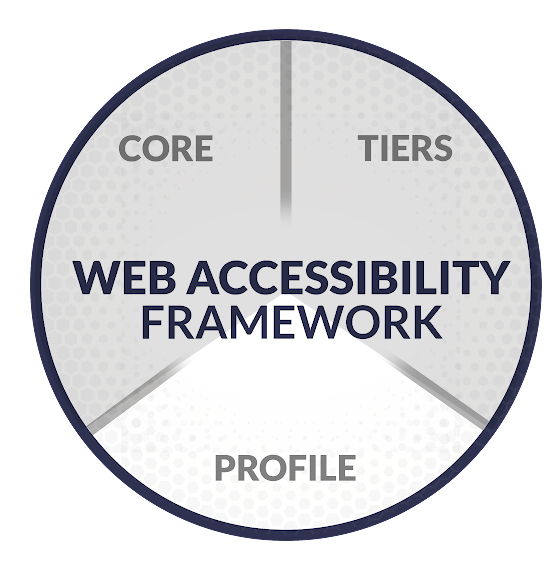

# What is a Profile?

Profiles help an organization understand the details of their current and desired accessibility environment. They help identify opportunities for improving web accessibility by comparing a "current" profile with a "target" profile.

A profile can be simple or complex – it just depends on what the organization needs. They could also be adjusted based on your industry and incorporate tiers.

It should answer these questions:

* Where are you at today? (current profile)
* Where do you want to be tomorrow? (target profile)
* What do you need to do to get to your target profile? (gap analysis)
* What is the priority?
* How will funding and resources be used?
* Depending on your organization’s complexity and accessibility needs, this could be as simple as a typed document or as complex as mapping priorities, gaps, and resources to the Core outcomes.

Here's an example of mapping current and target state, gaps, priority, and funding and resources to Core outcomes.

| Outcome ID | Current state | Desired state | Gap analysis | Funding and resources | Priority |
| ID.AM-1 – Public-facing websites and pages are inventoried | Started inventorying webpages but didn’t complete. | Inventory all 7 department websites. | Previous attempt failed because no follow up. Need to identify who is responsible in each department and set regular, brief check-ins until completed. | No funding needed. Departments should use CMS to export all web pages. Use shared drive to store inventory record. | High – Need to know all the pages we have, so we understand scope and can properly select high priority content. |

> Remember, this is just an example and profiles can be customized to meet your needs. You can focus on each Core outcome, sections of outcomes, or tiers for the entire organization, departments, or teams.

## Who should use a Profile?

All organizations can benefit from some sort of Profile detailing where they are, where they want to go, and other pertinent information about their accessibility environment.

Some Profiles can take longer to build especially if the organization has multiple departments and teams that need to be involved in accessibility. Organizations that wish to do a more complex Profile should decide if the time, buy-in, and resources are available to build that type of Profile. They can then use it as a road map to share when communicating with others and help decide what steps to take next.
