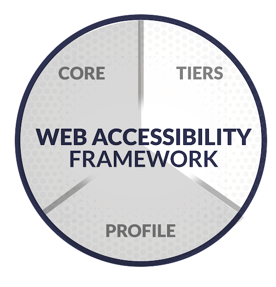

# What are Tiers?

Tiers are a way to determine your organization’s current and desired accessibility management practices. They are a maturity model for understanding the accessibility maturity of the organization. Tiers can be for the entire org or specific departments and teams and be adapted to your organization’s needs.

There are four tiers:

1. **Partial**: Organizations with on-demand or no web accessibility procedures. Organizations in tier 1 are categorized as having very little awareness of web accessibility risk. They frequently fail to prioritize web accessibility measures properly. 
2. **Risk informed**: Although tier 2 organizations have a fair amount of knowledge, they often lack a coordinated strategy and uniform policies across departments. Or, they potentially lack the authority to take effective measures to address them.
3. **Repeatable**: The third tier is organizations that follow web accessibility best practices and have received executive approval. Orgs in this category are often more equipped to deal with detected accessibility issues or potential barriers.
4. **Adaptive**: The topmost tier requires the greatest time and money to deploy and consists of organizations that are trained and adaptive to prevent accessibility issues and respond to accessibility barriers beyond defined accessibility standards. They are prepared to accommodate a wide range of user disabilities and accommodation requests.

Tier 1 and 2 typically are organizations that aren’t able to make their websites more accessible. Starting in tier 3, organizations actually have the processes and means to make accessibility improvements even if progress seems slow. Not every organization will be adaptive.

Once you understand your current and desired tier, you have a way to explain where your organization is at with leadership.

You can also use the Core to find ways to work toward your desired state or Profiles to further understand the details of your current and desired states.

## Who should use Tiers?

Any sized organization in any industry can benefit from understanding their current state when it comes to implementing accessibility. It helps get everyone on the same page about where the org is and where it wants to go.

Larger orgs or organizations working to get leadership buy-in can benefit even more from Tiers because understanding your org’s current tier and why your org is there can help communicate the issues with processes.

Explaining this alongside the desired state can be a strong way to communicate the org’s accessibility environment and potentially get buy-in from leadership.
